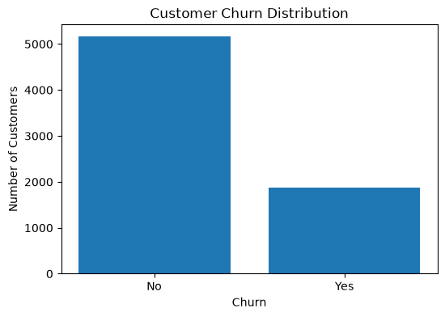
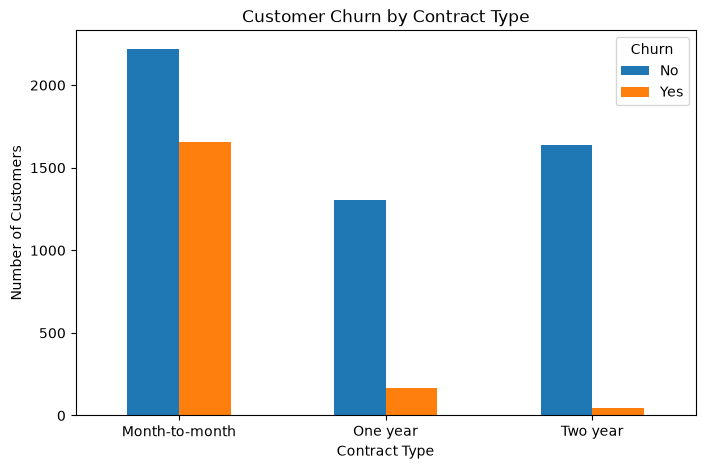
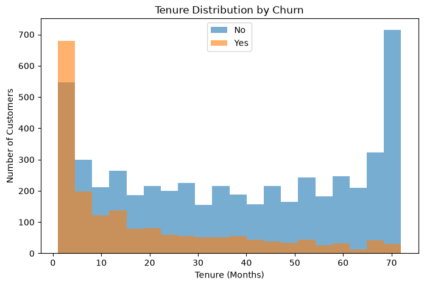
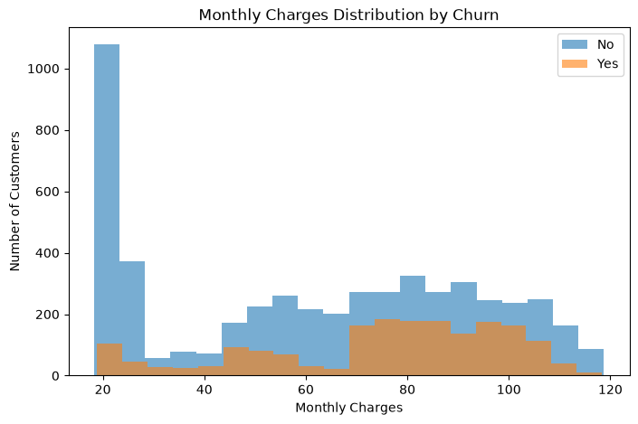
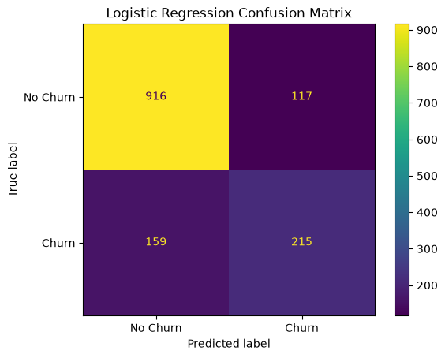

# telecom-customer-churn-prediction
Telecom customer churn analysis and prediction using Python, Pandas, data visualization and Logistic Regression.
#  Telecom Customer Churn Prediction

Telecom customer churn analysis and prediction using **Python, Pandas, data visualization, and Logistic Regression**.

##  Overview

Customer churn is a major challenge for subscription-based businesses. This project analyzes telecom customer data to understand the factors associated with customers leaving a company and builds a machine-learning model to predict whether a customer is likely to churn.

The project covers **data cleaning, exploratory data analysis, feature preparation, machine learning, and model evaluation**.

##  Project Objective

The main objectives of this project are to:

* Understand customer churn patterns
* Identify factors associated with higher churn
* Prepare categorical and numerical data for machine learning
* Build a Logistic Regression classification model
* Evaluate the performance of the model

##  Technologies Used

* Python
* Pandas
* NumPy
* Matplotlib
* Seaborn
* Scikit-learn
* Jupyter Notebook

##  Exploratory Data Analysis

The analysis investigated several important customer characteristics, including:

* Contract Type
* Tenure
* Monthly Charges
* Internet Service
* Payment Method

### Churn Distribution

### Churn by Contract Type

### Churn by Tenure

### Monthly Charges and Churn

##  Machine Learning

Categorical variables were converted into numerical features before splitting the dataset into training and testing sets.

**Training samples:** 5,625
**Testing samples:** 1,407

A **Logistic Regression** model was trained to classify customers as:

* `0` — Customer does not churn
* `1` — Customer churns

##  Model Performance

The Logistic Regression model achieved approximately **80% test accuracy**.

### Confusion Matrix

The confusion matrix shows how many churn and non-churn customers were correctly and incorrectly classified by the model.

##  Key Insights

The exploratory analysis indicated that:

* Customers with **month-to-month contracts** were more likely to churn.
* Customers with shorter **tenure** showed higher churn.
* Customers using **fiber optic internet** showed a comparatively higher churn rate.
* Customers using **electronic check** as their payment method showed higher churn.
* Monthly charges also showed a relationship with customer churn.

These factors can help telecom companies identify customers who may have a higher risk of leaving and develop targeted customer-retention strategies.

##  Future Improvements

Possible improvements include:

* Comparing Logistic Regression with Random Forest and XGBoost
* Handling class imbalance
* Performing hyperparameter tuning
* Evaluating ROC-AUC, Precision, Recall, and F1-score
* Deploying the trained model as a simple web application

##  Dataset

The project uses the **IBM Telco Customer Churn dataset**, which contains customer demographics, account information, subscribed services, and churn status.

##  Author

**Arshiyan**

Aspiring Data Analyst / Data Scientist

